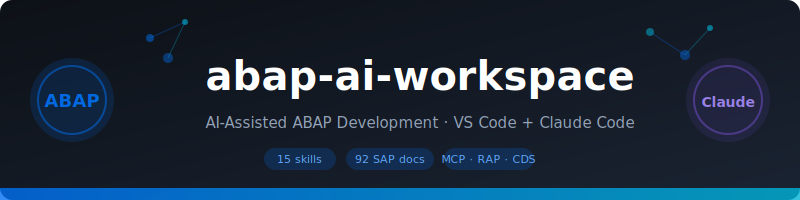

<p align="center">
  
</p>

# abap-ai-workspace

AI-assisted ABAP development workspace for VS Code + Claude Code.

Clone this repo, follow the 3-step setup, and Claude can create, edit, activate, test, and debug ABAP objects on your SAP systems — fully agentic.

---

## What's included

| Path | Purpose |
|------|---------|
| `.claude/skills/` | 15 Claude Code skills covering all ADT features |
| `docs/adt-vscode/` | 92 crawled SAP Help pages (offline reference) |
| `scripts/sap-help-crawl.mjs` | Crawler to refresh docs when SAP updates them |
| `CLAUDE.md` | Claude's instructions for this workspace |
| `AGENTS.md` | Agent config (works with GitHub Copilot too) |
| `.claude/workspace-systems.py` | Auto-detects SAP systems at session start |

---

## Setup (3 steps)

### Step 1 — Install VS Code extensions

Open VS Code. When prompted, install the recommended extension:

> **ABAP Development Tools for VS Code** (`sapase.adt-vscode`) — by SAP SE

Or manually: `Ctrl+Shift+X` → search `ABAP Development Tools` → Install

Also install the **ABAP Development Tools MCP Server** extension — visible in the Extensions sidebar under **MCP SERVERS — INSTALLED** after the main extension is installed.

### Step 2 — Connect your SAP system

1. Open this folder in VS Code: `File → Open Workspace from File → ABAP.code-workspace`
2. Add your SAP destination:
   - `Ctrl+Shift+P` → `ABAP: New Destination`
   - Choose **RFC** (on-premise / S/4HANA Private Edition) or **HTTP** (BTP / S/4HANA Public Cloud)
   - Follow the prompts
3. Add it to the workspace:
   - `Ctrl+Shift+P` → `ABAP: Add Destination as Folder to Workspace`

### Step 3 — Enable MCP server + wire to Claude

Enable in VS Code:
- `Ctrl+Shift+P` → `Preferences: Open Settings (UI)` → search `ADT MCP Server`
- ✅ Enable → set port `2236` → restart VS Code

Wire to Claude Code — run this in terminal:
```bash
# Auto-discovers token and writes .claude/settings.json
cd <this-repo>
TOKEN=$(python3 -c "
import json, os, sys
paths = [
  os.path.expanduser('~/Library/Application Support/Code/User/settings.json'),  # macOS
  os.path.expanduser('~/.config/Code/User/settings.json'),                       # Linux
  os.path.expandvars('%APPDATA%/Code/User/settings.json'),                       # Windows
]
for p in paths:
    try:
        s = json.load(open(p))
        print(s.get('adt.mcpServer.token',''))
        break
    except: pass
")
mkdir -p .claude
cat > .claude/settings.json << EOF
{
  "mcpServers": {
    "com.sap.adt/mcp": {
      "type": "http",
      "url": "http://localhost:2236/mcp",
      "headers": { "Authorization": "Bearer $TOKEN" }
    }
  }
}
EOF
echo "Done. Token: ${TOKEN:0:6}..."
```

Or run the Claude skill: `/abap-mcp-wire` (does the same thing automatically).

---

## Usage with Claude Code

Open this workspace in Claude Code (`claude` in the terminal from this folder).

Every session starts with a system check — Claude automatically knows which of your connected systems is the development system and which is read-only.

### Available skills

| Skill | What it does |
|-------|-------------|
| `/abap-help` | Answer any ADT question from crawled docs; re-crawls if outdated |
| `/abap-create` | Create any ABAP object (class, CDS, interface, etc.) via MCP |
| `/abap-activate` | Activate inactive objects |
| `/abap-open` | Open/search ABAP objects |
| `/abap-test` | Run ABAP Unit tests |
| `/abap-atc` | Run ATC quality checks |
| `/abap-debug` | Debug, syntax check, run class |
| `/abap-cds` | CDS development — create, extend, access controls |
| `/abap-rap-generate` | Generate full RAP stack |
| `/abap-transport` | Transport request management |
| `/abap-ai` | Joule AI features, ghost text, prompt tips |
| `/abap-collab` | Share links, switch to Eclipse ADT |
| `/abap-ref` | Keyboard shortcuts & quick reference |
| `/abap-mcp-wire` | Auto-configure MCP connection (run once per machine) |
| `/abap-connect` | Manual setup guide with troubleshooting |

### Example prompts

```
Create an ABAP class ZCL_TMP_HELLO that outputs "Hello World" to the console
```
```
How do I extend a CDS view entity?
```
```
Run unit tests for ZCL_MY_CLASS
```
```
Generate a RAP business object for equipment maintenance
```

---

## Refresh documentation

The `docs/adt-vscode/` folder contains crawled SAP Help pages. To refresh after a new ADT release:

```bash
npm install   # first time only
node scripts/sap-help-crawl.mjs \
  --start "https://help.sap.com/docs/abap-cloud/abap-development-tools-for-visual-studio-code/abap-development-tools-for-visual-studio-code?locale=en-US" \
  --output docs/adt-vscode \
  --depth 4 --delay 600
```

Or ask Claude: *"The docs seem outdated, please re-crawl"* — it will run the crawler automatically.

---

## System classification

Claude automatically classifies your connected SAP systems:

| System prefix | Role | Claude behaviour |
|--------------|------|-----------------|
| `ER1`, `ER2`, `ED1`, `D01`, `DEV`... | Development | ✅ Create/edit/activate/test here |
| `CC`, `CCF`, `CC3`, `CC7`... | Reference | ❌ Read-only — no writes ever |
| `QA`, `QEF`, `TST`... | Quality/Test | ❌ Read-only |
| Unknown | Ask | Claude asks you to confirm role |

---

## Security

- `.claude/settings.json` is in `.gitignore` — your bearer token is never committed
- Each developer generates their own token (Step 3 above)
- See `docs/adt-vscode/security-recommendations.md` for MCP security guidance
